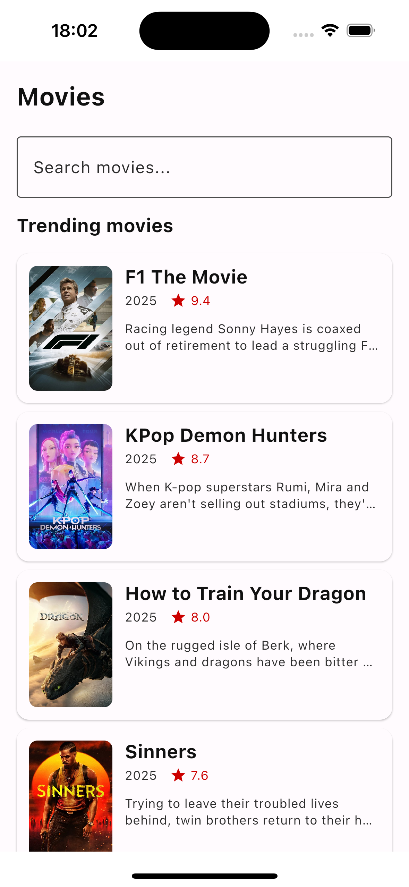
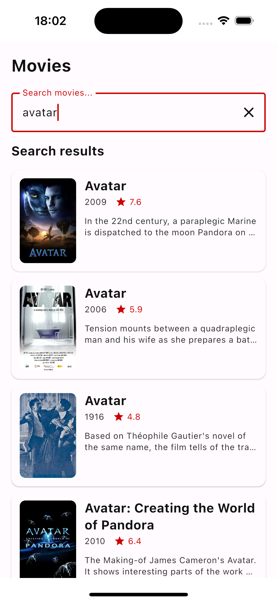
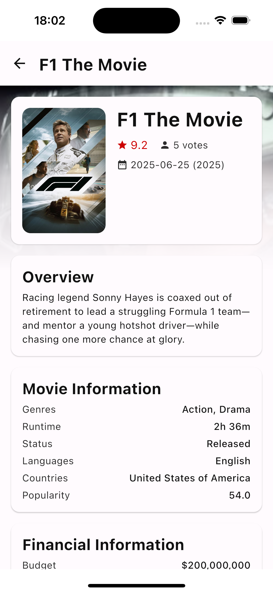

# 🎬 TMDB Movie App

A modern **Kotlin Multiplatform Mobile (KMM)** application showcasing trending movies and movie details using the TMDB API. Built with **Compose Multiplatform**, **Clean Architecture**, and **offline-first** principles.

## 📱 Demo

<div align="center">
  
  
  
</div>

## 📱 Features

### Core Functionality
- **📈 Trending Movies**: View today's trending movies from TMDB
- **🔍 Smart Search**: Real-time movie search with 300ms debouncing
- **📱 Movie Details**: Comprehensive movie information with ratings, cast, and more
- **🌐 External Links**: Direct access to IMDb and official movie websites
- **📲 Offline Support**: Cache trending movies and movie details for offline viewing

### Technical Highlights
- **🚀 Kotlin Multiplatform**: Shared business logic between Android & iOS
- **🎨 Compose Multiplatform**: Modern declarative UI framework
- **🏗️ Clean Architecture**: Separation of concerns with MVVM pattern
- **📦 Offline-First**: 5-minute cache expiration for optimal UX
- **🔄 Reactive Programming**: Kotlin Flow for real-time updates
- **🧪 Comprehensive Testing**: Unit tests and UI tests included
- **📱 Cross-Platform Logging**: iOS logs KMM data operations

## 🏗️ Architecture

The project follows **Clean Architecture** principles with clear separation of layers:

```
┌─ composeApp/           # Main application module
├─ feature/              # Feature-specific modules
│  ├─ movies/           # Movies list and search
│  └─ moviedetail/      # Movie detail screen
└─ core/                # Shared business logic
   ├─ model/            # Domain models
   ├─ data/             # Repository implementations
   ├─ database/         # Room database
   ├─ network/          # API client
   ├─ common/           # Shared utilities
   ├─ design-system/    # UI components
   ├─ ui/               # Shared UI utilities
   └─ utils/            # Helper functions
```

### 🔧 Technology Stack

| Category | Technology |
|----------|------------|
| **Language** | Kotlin Multiplatform |
| **UI Framework** | Compose Multiplatform |
| **Architecture** | MVVM + Clean Architecture |
| **Networking** | Ktor Client |
| **Database** | Room + SQLite |
| **DI** | Koin |
| **Async** | Kotlin Coroutines + Flow |
| **Image Loading** | Coil3 |
| **Testing** | Kotlin Test, Compose Testing |

## 🚀 Getting Started

### Prerequisites
- **Android Studio** Arctic Fox or later
- **Xcode** 14.0+ (for iOS development)
- **JDK** 17

### Setup Instructions

1. **Clone the repository**
   ```bash
   git clone <repository-url>
   cd what3wordsTechTest
   ```

2. **Open in Android Studio**
   - Import the project
   - Sync Gradle files
   - Wait for dependencies to download

3. **Run the application**
   
   **Android:**
   ```bash
   ./gradlew :composeApp:assembleDebug
   ```
   
   **iOS (from Xcode):**
   - Open `iosApp/iosApp.xcodeproj`
   - Select target device/simulator
   - Press Run

## 📁 Project Structure Details

### Core Modules

#### 🎯 `core/model`
Domain models representing movie data:
- `Movie` - Basic movie information for lists
- `MovieDetail` - Comprehensive movie details
- Support models (Genre, ProductionCompany, etc.)

#### 📊 `core/data`
Repository pattern implementation:
- `MovieRepository` - Data access abstraction
- `MovieRepositoryImpl` - Handles caching and network logic
- Data mappers for DTO ↔ Domain model conversion

#### 🗄️ `core/database`
Room database for offline storage:
- `MovieEntity` & `MovieDetailEntity` - Database entities
- `MovieDao` - Data access operations
- Cache expiration logic (5-minute timeout)

#### 🌐 `core/network`
TMDB API integration:
- `TmdbApiService` - API endpoints
- `HttpClientFactory` - Ktor client configuration
- DTOs for API responses

#### 🎨 `core/design-system`
Reusable UI components:
- `MovieCard` - Standardized movie item display
- `MovieButton` - Branded button component
- Theme definitions and color schemes

### Feature Modules

#### 🎬 `feature/movies`
Movies list and search functionality:
- `MoviesScreen` - Combined trending/search UI
- `MoviesViewModel` - State management with debounced search
- Automatic switching between trending and search modes

#### 📱 `feature/moviedetail`
Movie detail screen:
- `MovieDetailScreen` - Comprehensive movie information
- `MovieDetailViewModel` - Detail state management
- External link handling for IMDb and websites

## 🔄 Data Flow

```
UI Layer (Compose) → ViewModel → Repository → [Network/Cache] → Database
                                     ↓
                                Response flows back through the same chain
```

### Caching Strategy
- **Trending Movies**: 5-minute cache expiration
- **Movie Details**: 5-minute cache expiration
- **Search Results**: No caching (always fresh)

## 🧪 Testing

The project includes comprehensive testing coverage:

### Unit Tests for Data Repository
```bash

# Run tests for specific module
./gradlew :core:data:allTests
```
- Repository caching validation
- Data mapping accuracy

### UI Tests
```bash
./gradlew :composeApp:connectedDebugAndroidTest
```
- Movie list display
- Search functionality
- Movie detail screen interaction
- Error state handling

### Test Structure
- `core/data/src/commonTest/` - Repository tests
- `composeApp/src/commonTest/` - UI component tests
- Mock implementations for isolated testing

## 📲 Platform-Specific Features

### Android
- Material Design 3 theming
- Native Android navigation
- System-level sharing capabilities

### iOS
- **KMM Data Logging**: All data operations are logged via `NSLog`
- Native iOS navigation feel
- Platform-appropriate UI patterns

## 🎨 UI/UX Features

### Movies List Screen
- **Header Adaptation**: Shows "Trending Movies" or "Search Results"
- **Search Field**: Positioned at top with clear functionality
- **Movie Cards**: Include poster, title, year, and rating
- **Offline Indicator**: Visual feedback for cached content

### Movie Detail Screen
- **Rich Information**: Ratings, genres, runtime, financial data
- **External Links**: Homepage and IMDb integration
- **Responsive Layout**: Adapts to different screen sizes
- **Offline Support**: Previously viewed movies work offline

### Error Handling
- **Network Errors**: User-friendly offline messages
- **Server Errors**: Retry functionality with clear feedback
- **Empty States**: Informative messages for no results

## 🔧 Configuration

### API Configuration
The app uses TMDB API with JWT authentication. The API key is configured in the network module and all requests include proper authorization headers.

### Build Configuration
- **Minimum SDK**: Android 30
- **Target SDK**: Android 35
- **Compile SDK**: Android 35
- **iOS Deployment Target**: 14.0
- **JVM Target**: 17

## 🚨 Error Handling

The app implements comprehensive error handling:

```kotlin
sealed class MovieError : Exception() {
    data class NetworkError(override val message: String) : MovieError()
    data class ServerError(override val message: String) : MovieError()
    data class CacheError(override val message: String) : MovieError()
    data class DataNotFoundError(override val message: String) : MovieError()
    data class UnknownError(override val message: String) : MovieError()
}
```

## 🎯 Key Implementation Details

### Debounced Search
- 300ms delay after user stops typing
- Prevents excessive API calls
- Smooth user experience

### Cache Management
- 5-minute expiration for trending movies
- Automatic fallback to cache when offline
- Force refresh capability

### Cross-Platform Logging
- Logger expect/actual pattern for cross-platform logging
- Android: Uses `Log.d/i/w/e`
- iOS: Uses `NSLog` for KMM operations

## 📝 Requirements Compliance

- **Trending Movies**: TMDB trending endpoint with caching  
- **Search Functionality**: TMDB search endpoint (online-only)  
- **Movie Details**: Comprehensive detail screen with offline support  
- **External Links**: IMDb and homepage integration  
- **KMM Architecture**: Shared business logic  
- **iOS Logging**: Data operations logged via KMM  
- **Unit Tests**: Repository and caching validation  
- **UI Tests**: Screen interaction testing  
- **Error Handling**: Offline/online/API failure scenarios

---

**Built using Kotlin Multiplatform and Compose Multiplatform**